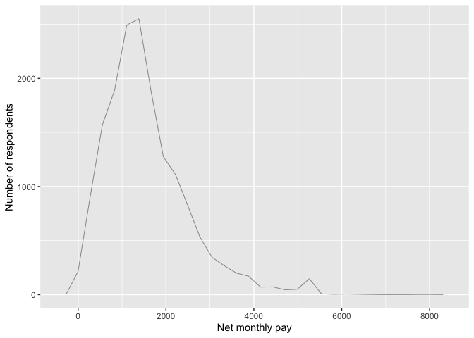
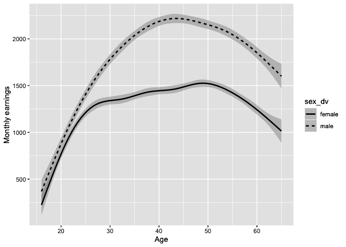
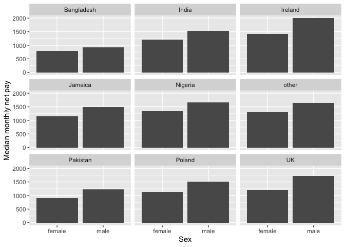
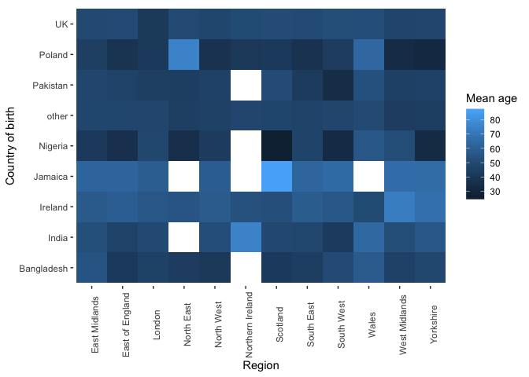
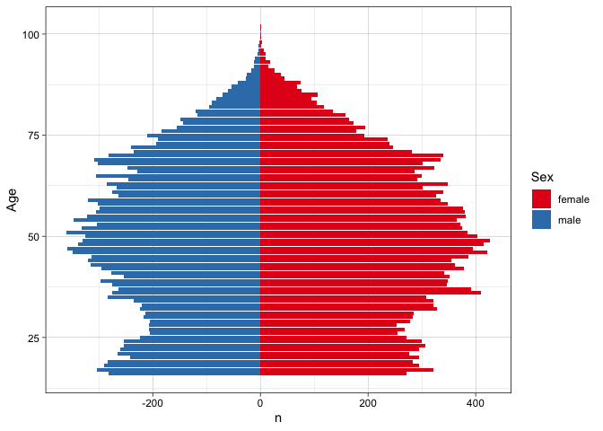

Statistical assignment 4
================
Jenson Wong - 670034697
29 February 2020

In this assignment you will need to reproduce 5 ggplot graphs. I supply graphs as images; you need to write the ggplot2 code to reproduce them and knit and submit a Markdown document with the reproduced graphs (as well as your .Rmd file).

First we will need to open and recode the data. I supply the code for this; you only need to change the file paths.

    ```r
    library(tidyverse)
    Data8 <- read_tsv("~/Documents/University/Year 3/UKDA-6614-tab/tab/ukhls_w8/h_indresp.tab")
    Data8 <- Data8 %>%
        select(pidp, h_age_dv, h_payn_dv, h_gor_dv)
    Stable <- read_tsv("/Users/jsn2817/Documents/University/Year 3/UKDA-6614-tab/tab/ukhls_wx/xwavedat.tab")
    Stable <- Stable %>%
        select(pidp, sex_dv, ukborn, plbornc)
    Data <- Data8 %>% left_join(Stable, "pidp")
    rm(Data8, Stable)
    Data <- Data %>%
        mutate(sex_dv = ifelse(sex_dv == 1, "male",
                           ifelse(sex_dv == 2, "female", NA))) %>%
        mutate(h_payn_dv = ifelse(h_payn_dv < 0, NA, h_payn_dv)) %>%
        mutate(h_gor_dv = recode(h_gor_dv,
                         `-9` = NA_character_,
                         `1` = "North East",
                         `2` = "North West",
                         `3` = "Yorkshire",
                         `4` = "East Midlands",
                         `5` = "West Midlands",
                         `6` = "East of England",
                         `7` = "London",
                         `8` = "South East",
                         `9` = "South West",
                         `10` = "Wales",
                         `11` = "Scotland",
                         `12` = "Northern Ireland")) %>%
        mutate(placeBorn = case_when(
                ukborn  == -9 ~ NA_character_,
                ukborn < 5 ~ "UK",
                plbornc == 5 ~ "Ireland",
                plbornc == 18 ~ "India",
                plbornc == 19 ~ "Pakistan",
                plbornc == 20 ~ "Bangladesh",
                plbornc == 10 ~ "Poland",
                plbornc == 27 ~ "Jamaica",
                plbornc == 24 ~ "Nigeria",
                TRUE ~ "other")
        )
    ```

Reproduce the following graphs as close as you can. For each graph, write two sentences (not more!) describing its main message.

1.  Univariate distribution (20 points).

    ``` r
    ggplot(Data, aes(h_payn_dv)) +
      geom_freqpoly(binwidth = 277, size = 0.15) +
      xlab("Net monthly pay") +
      ylab("Number of respondents")
    ```

    

The distribution for income in the survey shows that a majority of respondants have an income around 1400 per month. The median income is also around 1400 as well.

1.  Line chart (20 points). The lines show the non-parametric association between age and monthly earnings for men and women.

    ``` r
    Data.r <- Data %>% 
      filter(h_age_dv <= 65)
    ggplot(Data.r, aes(x = h_age_dv, y= h_payn_dv)) + 
      geom_smooth(span = 0.1,aes(linetype = sex_dv))+
      xlab("Age") +
      ylab("Monthly earnings") +
      scale_color_manual(values = "black")+
     labs(linetype="Sex")
    ```

    

On the whole for ages up to retirement age (65), there is a significant pay gap between the genders. The deviation starts around the age in which women are expected to have children (25-30).

1.  Faceted bar chart (20 points).

    ``` r
    Data.r <- Data.r %>% 
      filter(!is.na(h_payn_dv) & !is.na(placeBorn))
    ggplot(Data.r, aes(x = sex_dv, y = h_payn_dv)) +
    geom_bar(stat = "summary", fun.y = "median") +
    facet_wrap(~ placeBorn)+
    xlab("Sex") +
    ylab("Median monthly net pay")
    ```

    

Here not only is the gender pay gap evident, but also the pay gap between ethnic groups. Additionally, the gender pay gap is most significant for groups that have a higher mean income (People born in the British Isles).

1.  Heat map (20 points).

    ``` r
    Data.rr <- Data %>% 
      filter(!is.na(placeBorn) & 
             !is.na(h_gor_dv) & 
             !is.na(h_age_dv)) %>% 
      group_by(placeBorn, h_gor_dv) %>% 
      mutate(m.age = mean(h_age_dv))

    ggplot(Data.rr, aes(h_gor_dv, placeBorn, fill= m.age)) + 
      geom_tile() +
    xlab("Region") +
    ylab("Country of birth") +
     labs(fill="Mean age") +
      theme(axis.text.x = element_text(angle=90),
        panel.grid = element_blank(),
        panel.background = element_blank())
    ```

    

In general, the mean age of people born outside the UK is higher than their UK counterparts. This indicate that they are likely first generation immigrants, and that they have had children in the UK.

1.  Population pyramid (20 points).

    ``` r
    Pop.Pyr <- Data %>%
      select(sex_dv, h_age_dv) %>% 
      group_by(sex_dv, h_age_dv) %>% 
      summarise(n = n()) %>% 
      mutate(sex_r = ifelse(sex_dv == "male", -1, 1)) %>% 
      mutate(n = n * sex_r)

    ggplot(Pop.Pyr, aes(x = h_age_dv, y = n, fill = sex_dv)) + 
      geom_bar(data = subset(Pop.Pyr, sex_dv == "female"), stat = "identity") +
      geom_bar(data = subset(Pop.Pyr, sex_dv == "male"), stat = "identity")+
      scale_fill_manual(values = c("#E41B1B", "#367EB8")) +
      coord_flip() +
    xlab("Age") +
    ylab("n") +
     labs(fill="Sex") + 
      theme_linedraw()
    ```

    

In the above population pyramid, there is an imbalance with regard to the gender distribution of the overall population. Moreover, the population is aging as demonstrated by the larger distribution of individuals in the ages of around 50.
